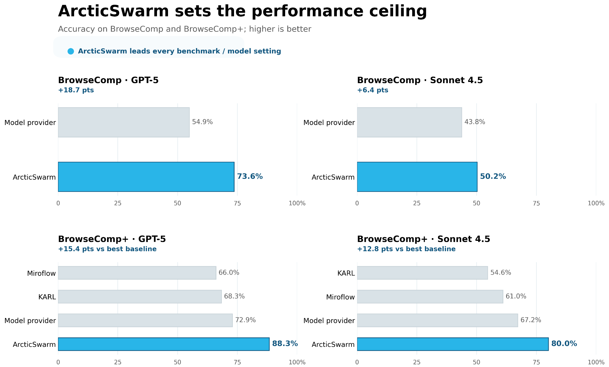
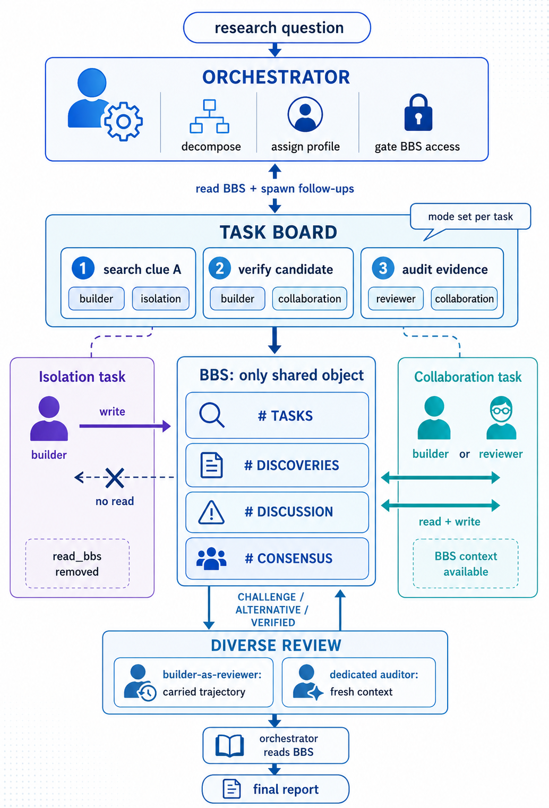

<!--
  Before making the repo public, replace <your-org> below with the real GitHub
  org/repo (clone command + optionally uncomment [project.urls] in pyproject.toml).
-->

<div align="center">

# ❄️ ArcticSwarm

**A state-of-the-art, fully open-source multi-agent framework for long-horizon web research — and the harness that reproduces it.**

[](LICENSE)
[](pyproject.toml)
[](https://arxiv.org/abs/2609.01870)
[](https://www.snowflake.com/en/blog/engineering/arcticswarm-multi-agent-system-architecture/)
[](CONTRIBUTING.md)

</div>

In plain terms: instead of asking one agent the same question many times and majority-voting, ArcticSwarm runs a **swarm of agents that research the web independently, then cross-examine each other's findings** before committing to an answer. That one design choice — **deferring early consensus** — is what lifts it past the model providers' own deep-research systems and the strongest open-source swarms on hard, long-horizon benchmarks.

> **Explore independently first. Review together second. Commit only after evidence survives disagreement.**

## Contents

- [✨ Highlights](#-highlights)
- [🔥 Why ArcticSwarm?](#-why-arcticswarm)
- [🏆 Headline results](#-headline-results)
- [🧠 How it works](#-how-it-works)
- [🧰 Requirements](#-requirements)
- [⚙️ 1. Install](#-1-install)
- [🔑 2. Configure](#-2-configure)
- [📥 3. Get the datasets](#-3-get-the-datasets)
- [🚦 4. Smoke test](#-4-smoke-test)
- [🏁 5. Run the benchmarks](#-5-run-the-benchmarks)
- [🧪 6. Custom evaluation](#-6-custom-evaluation)
- [📊 7. Results and the viewer](#-7-results-and-the-viewer)
- [❓ FAQ](#-faq)
- [🤝 Contributing](#-contributing)
- [📎 Citation](#-citation)
- [📜 License](#-license)

## ✨ Highlights

- **🧠 Defers early consensus.** Diversity is kept alive in *two* places: independent generation (subagents research in isolation) **and** review (peers issue `Challenge` / `Alternative` / `Verified` verdicts that reshape the search) — not a single majority vote.
- **🏆 State-of-the-art accuracy.** **73.6%** on BrowseComp and **88.3%** on BrowseComp-Plus with GPT-5 — ahead of every model-provider deep-research system and the best open-source swarm (ArcticSwarm paper, 2026).
- **🔀 Model-agnostic.** The *same* orchestration drives the gains across families — GPT-5, Claude Sonnet 4.5 / 4.6 — evidence that the orchestration, not scale, is the dominant factor. It also runs the *entire* swarm on **fully self-hosted open weights** (Qwen 3.5-27B via vLLM) — **82.6%** on BrowseComp-Plus.
- **🌐 Live web + pluggable corpus.** BrowseComp runs against the live web; BrowseComp-Plus retrieves from a fixed corpus through a pluggable backend (`stub` / `local` / `cortex`) — the harness runs out of the box.
- **🧪 Bring your own eval.** Point a config at your CSV and (optionally) your own judge rubric — **no framework code to edit**.
- **🔍 Reproducible + inspectable.** Every BrowseComp / BrowseComp-Plus number comes from a shipped config in `conf/bench/` with the GPT-4.1 judge, and a bundled viewer replays any run's per-agent trajectories, bulletin-board posts, and judge verdicts.

## 🔥 Why ArcticSwarm?

Multi-agent pipelines shine when a *verifier* exists (compile it, run the unit test) — but **long-horizon search is not coding.** Open-ended research has no such verifier, so systems fall back on **majority voting / self-consistency**, which converges too fast on a plausible-but-wrong hypothesis. The dangerous failure mode isn't an agent finding *nothing*; it's uncovering something *plausible* too early and quietly halting the search. ArcticSwarm treats that "premature consensus" as *the* failure mode and removes it:

- **No premature consensus.** During search, subagents run in **isolation** — they may *post* findings to a gated bulletin board but **cannot read it** — so you get *N* rollouts from *N* independent priors, not *N* correlated samples from one shared posterior.
- **Review is an active control signal, not a post-hoc vote.** Reviewers carry their own evidence and issue structured `Challenge` / `Alternative` / `Verified` verdicts that feed back into the board and *reshape ongoing search* — overturning an emerging wrong consensus while there's still time to act.
- **It's the orchestration, not the model.** The same coordination lifts GPT-5, Sonnet 4.5, and Sonnet 4.6 alike.
- **It's reproducible.** Headline BrowseComp / BrowseComp-Plus numbers rebuild from shipped `conf/bench/` presets with the standard GPT-4.1 judge.

## 🏆 Headline results

> **Best-in-class on every model and benchmark tested** — 73.6% on BrowseComp and 88.3% on BrowseComp-Plus with GPT-5, ahead of the providers' own deep-research stacks and the strongest open swarm.

<div align="center">
  
</div>

| Benchmark | Model | Model-provider deep research | MiroFlow (best open swarm) | **ArcticSwarm** |
|---|---|---|---|---|
| **BrowseComp** (full, 1,266 q) | GPT-5 | 54.9% | 63.4% | **73.6%** |
| **BrowseComp** (full, 1,266 q) | Sonnet 4.5 | 43.8% | — | **50.2%** |
| **BrowseComp-Plus** (full, 830 q) | GPT-5 | 72.9% | 66.0% | **88.3%** |
| **BrowseComp-Plus** (full, 830 q) | Sonnet 4.5 | 67.2% | 61.0% | **80%** |

<sub>Numbers are from the ArcticSwarm paper's main results tables. "Model-provider deep research" = OpenAI (GPT-5) and Anthropic (Sonnet 4.5) in-house research stacks; BrowseComp-Plus provider numbers are from the Opus 4.5 System Card. "—" means no comparable published baseline at that model. MiroFlow BrowseComp-Plus numbers are our matched-configuration reruns.</sub>

<sub>**Retrieval caveat:** BrowseComp-Plus retrieval uses Arctic Embed L v2.0; several baselines use the stronger Qwen3-Embed-8B, so read those rows with that retriever-side handicap in mind. The same orchestration also runs end-to-end on **fully self-hosted open weights** (Qwen 3.5-27B) — see [§5](#-5-run-the-benchmarks).</sub>

> **🔓 Fully open weights** — *the entire agent swarm on self-hosted **Qwen 3.5-27B** (only the optional eval judge is a closed model); reproducible from the shipped `conf/bench/` presets:*
> - **82.6%** on **BrowseComp-Plus** — competitive with the GPT-5 model-provider deep-research stack (72.9%).
>
> vLLM launch + exact commands in [§5](#-5-run-the-benchmarks).

## 🧠 How it works

ArcticSwarm routes all inter-agent communication through a single **Bulletin Board System (BBS)** with a per-task *access mode*. An orchestrator decomposes the question into subtasks, tags each with a **profile** (browsing or reasoning) and a **mode** (isolation or collaboration), and posts them. Subagents claim tasks; at least one **dedicated reviewer** runs throughout.

<div align="center">
  
</div>

1. **Diverse generation (isolation).** Each subagent has a distinct profile, tools, context budget, and *private* search history. In **isolation mode** it may write to the board but **cannot read it**, so hypotheses don't collapse toward whoever posted first — *N* rollouts from *N* priors with disjoint evidence trails.
2. **Diverse review (collaboration).** When search completes, agents enter collaboration mode. The reviewer pool mixes **builders-as-reviewers** (carrying first-hand trajectory evidence) and **dedicated reviewers** (independent perspectives). Verdicts — `Challenge` (a failed constraint / weak source), `Alternative` (a better-fitting candidate), `Verified` (each constraint backed by evidence) — re-enter the board and steer still-active search.
3. **Budget-aware finish.** A staged, budget-keyed signal blocks web tools near the deadline and asks the orchestrator to write the report; a verifier locks the `prepare_report` call and asks for more search if gaps remain. A separate LLM judge (GPT-4.1) then scores the committed answer — it never touches the agent trajectory.

### It's the orchestration, not the model

Holding the model, timeout, and tool access fixed — *only the coordination changes* — the gated BBS wins. On the full 830-question BrowseComp-Plus set with self-hosted Qwen 3.5-27B:

| Communication mode | Accuracy |
|---|---|
| Single agent (ArcticSwarm harness) | 48.4% |
| Direct messaging (DM) | 61.9% |
| Duo (leader + auditor) | 66.1% |
| **Gated BBS (ArcticSwarm)** | **82.6%** |

- **Single-agent and direct-messaging both underperform the gated swarm**; a **duo (one investigator + one auditor) closes part of the gap (66.1%)**, and the **full gated swarm reaches 82.6%** — structured coordination, not agent count alone, drives the gain.
- MiroFlow has the *stronger* single-agent harness (**57.4%** vs. our 48.4%), so the improvement comes from the **architecture**, not the harness.

Reviewer *diversity* is where accuracy is won or lost. Bucketing the full GPT-5 BrowseComp run by which reviewer sources posted a `Verified` verdict:

| Verifier pattern (BrowseComp, n = 1,266) | Accuracy |
|---|---|
| **Dedicated + builder reviewer** | **86.4%** |
| Builder reviewer only | 70.9% |
| Dedicated reviewer only | 66.1% |
| No reviewer verdict | 35.3% |

<sub>Reviewer-source diversity vs. accuracy (ArcticSwarm paper, reviewer-diversity analysis). The 35.3% "no reviewer verdict" bucket is the premature-commitment survival regime — the swarm settled on an early candidate that no mid-search verdict ever challenged. The ordering replicates on BrowseComp-Plus.</sub>

<details>
<summary><b>The theory: why deferring consensus wins</b></summary>

With a reliable verifier (coding, math), best-of-*N* + selection is embarrassingly parallel and effective. Without one, majority voting is only a good proxy for *short, fact-based* answers where correctness correlates with agreement. In open-ended, long-horizon research the right candidate is often *not* in the initial pool, and a shared workspace couples every agent's posterior from the first observation — so the swarm anchors early. ArcticSwarm keeps the priors independent during search (isolation) and injects diversity again at review (trajectory-aware + independent reviewers whose verdicts reshape the pool), turning selection from a passive vote into an active control loop. See the [paper](#-citation) for the ablations (premature-commitment stratification, rollout de-correlation vs. free communication and independent best-of-*N*, and reviewer-source diversity).

</details>

> 📝 **Go deeper:** the engineering blog walks through the design — [Inside the ArcticSwarm architecture](https://www.snowflake.com/en/blog/engineering/arcticswarm-multi-agent-system-architecture/) (orchestrator, gated BBS, isolation vs. collaboration, reviewer verdicts) and the broader [hybrid deep-research](https://www.snowflake.com/en/blog/engineering/arcticswarm-hybrid-deep-research/) motivation — and the [paper](#-citation) has the full ablations.

## 🧰 Requirements

- **Python 3.11+** (validated on 3.12).
- **Java 11+** — only for PDF reading (`web_fetch` on PDFs / `pdf_read`); the backend auto-starts, no manual setup.
- **API access** to your model of choice (Anthropic / OpenAI-compatible) and, for live BrowseComp, one web-search key (Brave / Serper / Tavily).
- **Optional — the fully open path:** a GPU node to self-host Qwen 3.5-27B via vLLM (we used a single 8×H200 node).

## ⚙️ 1. Install

```bash
# git clone https://github.com/<your-org>/arcticswarm.git && cd arcticswarm
pip install -r requirements.txt   # pinned, validated versions
pip install -e . --no-deps        # the arcticswarm + arcticswarm-eval CLIs
```

(`pip install -e .` alone also works, using the looser ranges in `pyproject.toml`.) This installs two CLIs: `arcticswarm` (interactive agent) and `arcticswarm-eval` (the benchmark runner). Full setup notes, including the optional Snowflake/Cortex extra (`pip install 'arcticswarm[cortex]'`), are in **[ENVIRONMENT.md](ENVIRONMENT.md)**.

## 🔑 2. Configure

All secrets and endpoints live in a single JSON **settings file**. Copy the template and fill in what you have:

```bash
cp config_files.template.json config_files.json   # then edit config_files.json
```

- **Default location:** `./config_files.json` (repo root). It is git-ignored, so your real keys are never committed — only the template is tracked.
- **Custom path:** point `ARCTICSWARM_SETTINGS_PATH` at any file: `export ARCTICSWARM_SETTINGS_PATH=/etc/arcticswarm/prod.json`.
- The template's `__help__` block documents every key. Minimal example:

```json
{
  "api_key": "sk-ant-...",
  "base_url": "https://api.anthropic.com",
  "openai_api_key": "sk-...",
  "openai_base_url": "https://api.openai.com/v1",
  "brave_api_key": "", "serper_api_key": "", "tavily_api_key": "",
  "jina_api_key": ""
}
```

| Key | Needed for |
|-----|-----------|
| `api_key` + `base_url` | **Claude** agent and/or judge (public Anthropic API by default) |
| `openai_api_key` + `openai_base_url` | **GPT-5** agent and the default **`openai-gpt-4.1` judge** |
| `brave_api_key` / `serper_api_key` / `tavily_api_key` | **Live web search** (any one; Brave primary, Serper/Tavily fallbacks) |
| `jina_api_key` | **Web/PDF fetch** via Jina Reader (optional — fetch falls back to Serper → `requests`) |

> **Two kinds of "config" — don't confuse them:** the **settings file** above (`config_files.json`, secrets/endpoints) vs. the **run configs** you pass with `--config conf/bench/*.yaml` (which benchmark/model/tools to run). The settings file is resolved once from `ARCTICSWARM_SETTINGS_PATH` or `./config_files.json`; the run configs are explicit CLI args.

<details>
<summary><b>Choosing the eval judge (Claude / self-hosted / Azure)</b></summary>

The eval judge runs *after* each question and never sees or alters the agent trajectory. The shipped configs default to the public **`openai-gpt-4.1`** judge (needs `openai_api_key`).

- **Claude judge:** `eval.judge_model=claude-sonnet-4-5`
- **Self-hosted judge:** `eval.judge_model=<served-id> eval.judge_model_base_url=<url>`
- **Azure GPT-4.1 deployment:** `azure.enabled=true eval.judge_model=<your-deployment>` with `AZURE_OPENAI_API_KEY` / `AZURE_OPENAI_ENDPOINT` in `config_files.json`. (The run-config override `azure.enabled=true` is the equivalent of the settings-file key `use_azure_openai: true`.)

</details>

## 📥 3. Get the datasets

ArcticSwarm does **not** redistribute benchmark questions or gold answers. One command downloads + decrypts them from their official sources and rebuilds every subset locally:

```bash
bash scripts/fetch_datasets.sh              # BrowseComp + BrowseComp-Plus subsets
```

This writes the CSVs under `arcticswarm/eval/data/` (git-ignored — regenerate, don't commit). See **[DATASETS.md](DATASETS.md)** for per-dataset sources, licenses, citations, and the BrowseComp-Plus retrieval-corpus setup.

## 🚦 4. Smoke test

```bash
arcticswarm-eval -c conf/bench/browsecomp.yaml eval.limit=1 eval.output=/tmp/smoke
```

## 🏁 5. Run the benchmarks

Each preset in `conf/bench/` is a complete run config; override any key on the CLI with dotted paths (`eval.output=...`, `llm.model=...`). Every backend below uses the **same orchestration** — only the model changes.

> 💡 **Cost note:** ArcticSwarm runs a *swarm* of agent calls per question, so full-benchmark runs are token-intensive. Start with `eval.limit=20` to gauge cost and latency before committing to a full run.

### BrowseComp (live web)

```bash
# Claude Sonnet 4.5
arcticswarm-eval -c conf/bench/browsecomp.yaml llm.model=claude-sonnet-4-5 eval.output=results/bc_sonnet45

# OpenAI GPT-5  (requires openai_api_key)
arcticswarm-eval -c conf/bench/browsecomp.yaml llm.model=gpt-5 llm.openai_base_url=https://api.openai.com/v1 llm.reasoning_effort=high eval.output=results/bc_gpt5

# Fully open, self-hosted Qwen 3.5-27B on a vLLM endpoint
arcticswarm-eval -c conf/bench/browsecomp_qwen.yaml llm.agent_model_base_url=http://<your-vllm-host>:7777/v1 eval.output=results/bc_qwen35
```

Models whose name contains `qwen` / `tongyi` route to the vLLM backend.

> 💡 **Lighter option:** **`conf/bench/browsecomp_qwen_efficient.yaml`** flips on every efficiency lever (fewer subagents, source scorer off, context reset between tasks) — substantially lower token/latency cost for only a small accuracy drop. A good starting point for trying the open-weights path before committing to the full swarm.

<details>
<summary><b>Exact vLLM launch (single 8×H200 node) — the open, self-hosted setup</b></summary>

We served Qwen 3.5-27B (bf16 weights, fp8 KV cache) to run the *whole* swarm on open weights (point `HF_HOME` at your own HuggingFace cache):

```bash
export HF_HOME=/path/to/hf-cache
export VLLM_ENGINE_READY_TIMEOUT_S=2400
export TORCH_NCCL_ENABLE_MONITORING=0
export VLLM_MEMORY_PROFILER_ESTIMATE_CUDAGRAPHS=1
export PYTORCH_CUDA_ALLOC_CONF=expandable_segments:True

vllm serve Qwen/Qwen3.5-27B \
  --served-model-name Qwen/Qwen3.5-27B --host 0.0.0.0 --port 7777 \
  --data-parallel-size 1 --tensor-parallel-size 8 --kv_cache_dtype fp8 \
  --max-model-len 262144 --gpu-memory-utilization 0.90 \
  --max-num-seqs 512 --max-num-batched-tokens 16384 \
  --mamba-cache-mode align --mamba-block-size 8 \
  --attention-backend FLASHINFER --enable-prefix-caching --async-scheduling \
  --language-model-only --reasoning-parser qwen3 \
  --enable-auto-tool-choice --tool-call-parser qwen3_xml \
  --trust-remote-code --seed 0 --disable-custom-all-reduce
```

</details>

### BrowseComp-Plus (corpus retrieval)

BrowseComp-Plus replaces live search with retrieval over a fixed corpus. The retrieval backend is **pluggable** via `web.corpus_backend`, so the harness runs out of the box:

| `web.corpus_backend` | What it does | Setup |
|---|---|---|
| `stub` (default) | No real retrieval — pipeline runs end-to-end for smoke tests; scores will be low | none |
| `local` | Retrieves from a local corpus JSONL with a built-in scorer — a template for your own retriever (BM25/embeddings) | a corpus `.jsonl` at `web.corpus_local_path`; see `arcticswarm/tools/corpus_retriever.py` |
| `cortex` | Retrieves from a Snowflake **Cortex Search** service (the paper's backend) | a Snowflake account + Cortex Search service over the BC-Plus corpus + a PAT |

```bash
arcticswarm-eval -c conf/bench/browsecomp_plus.yaml llm.model=gpt-5 llm.openai_base_url=https://api.openai.com/v1 eval.output=results/bcp_gpt5

# Fully open, self-hosted Qwen 3.5-27B (the 82.6% result) — point at your vLLM endpoint
arcticswarm-eval -c conf/bench/browsecomp_plus.yaml llm.model=Qwen/Qwen3.5-27B llm.agent_model_base_url=http://<your-vllm-host>:7777/v1 eval.output=results/bcp_qwen35
```

The BrowseComp-Plus corpus (`Tevatron/browsecomp-plus-corpus`) and how to wire each backend are documented in **[DATASETS.md](DATASETS.md)**. The `corpus_backend: cortex` coordinates live (commented, with placeholders) in each `conf/bench/browsecomp_plus*.yaml`.

**Common knobs:** `eval.limit=20` (cap cases) · `eval.parallel=8` (concurrency) · `eval.csv_path=...` (swap the question set) · `eval.repeat=3` (multi-run with stddev).

## 🧪 6. Custom evaluation

Evaluate on **your own dataset and your own judge rubric without editing any framework code** — point a config at your CSV and (optionally) a judge-prompt template:

```yaml
eval:
  csv_path: path/to/my_dataset.csv
  datasets: [MY_DATASET]
  custom_judge_prompt: path/to/my_rubric.txt   # optional; {question}/{response}/{correct_answer}
```

```bash
arcticswarm-eval -c conf/bench/custom_example.yaml eval.output=results/my_eval
```

Full walkthrough (CSV format, rubric contract, example): **[docs/custom_evaluation.md](docs/custom_evaluation.md)**.

## 📊 7. Results and the viewer

Each run writes `results/<name>/` — per-case trajectories plus a `report.json` with accuracy and detailed metrics. Browse a run interactively with the bundled viewer by pointing it at that results **directory**:

```bash
python viewer/server.py results/<run_dir>          # opens the printed localhost URL
python viewer/server.py results/<run_dir> --tunnel # also expose a public Cloudflare quick-tunnel URL
```

The viewer is local-only by default (binds `127.0.0.1`, no tunnel). See **[viewer/README.md](viewer/README.md)** for options.

## ❓ FAQ

<details>
<summary><b>Do I need a GPU?</b></summary>

No — the GPT-5 and Claude paths are pure API calls. A GPU node is needed **only** for the fully open, self-hosted path (serving Qwen 3.5-27B via vLLM; we used a single 8×H200 node).

</details>

<details>
<summary><b>Which judge is used, and does it see the agent's work?</b></summary>

The default is the public **`openai-gpt-4.1`** judge (needs `openai_api_key`). It runs *after* each question and **never sees or alters the agent trajectory**. Claude, a self-hosted judge, or an Azure GPT-4.1 deployment also work — see the collapsible in [§2 Configure](#-2-configure).

</details>

<details>
<summary><b>How do I run on a self-hosted / vLLM model?</b></summary>

Any `llm.model` whose name contains `qwen` or `tongyi` routes to the vLLM backend; set `llm.agent_model_base_url` to your endpoint (a comma-separated list is load-balanced). See the vLLM launch in [§5](#-5-run-the-benchmarks).

</details>

<details>
<summary><b>Is anything cached across runs?</b></summary>

Not by default. Every search and fetch is **live**, and the only always-on cache is a **within-question** dedup: since 32–43% of fetches are cross-agent duplicates *within a single question*, a URL fetched once during a question returns from disk for the rest of that question (`{eval.output}/cache/content/<case_id>/`; hits are byte-identical to live fetches; disable with `enable_content_cache=false`). A new run re-fetches live unless you opt into the **optional cross-run fetch cache** (`web.fetch_cache_path`, off by default — see [ENVIRONMENT.md](ENVIRONMENT.md)), which persists fetched pages across runs for cheaper re-runs; its hits are byte-identical to live.

</details>

<details>
<summary><b>Do I need a Snowflake account?</b></summary>

No. ArcticSwarm runs fully without Snowflake. The Cortex corpus / web-search backend is optional (`pip install 'arcticswarm[cortex]'`) and only used when you explicitly select it.

</details>

<details>
<summary><b>PDF reading isn't working.</b></summary>

PDF extraction needs **Java 11+** (`brew install openjdk` / `apt install default-jdk`). Without it, `web_fetch` on PDFs falls back to a lighter path. See [ENVIRONMENT.md](ENVIRONMENT.md).

</details>

## 🤝 Contributing

Contributions are welcome! See **[CONTRIBUTING.md](CONTRIBUTING.md)** for dev setup, tests (`pytest`), and the PR workflow. Secrets go in the git-ignored `config_files.json`, never in the repo.

## 📎 Citation

If you use ArcticSwarm, please cite the paper ([arXiv:2609.01870](https://arxiv.org/abs/2609.01870)):

```bibtex
@misc{yoon2026arcticswarmdeferringearlyconsensus,
      title={ArcticSwarm: Deferring Early Consensus in Long-Horizon Multi-Agent Research}, 
      author={Soyoung Yoon and Boyi Liu and Yite Wang and Ruofan Wu and Canwen Xu and Nikki Lijing Kuang and Seung-won Hwang and Yuxiong He and Zhewei Yao},
      year={2026},
      eprint={2609.01870},
      archivePrefix={arXiv},
      primaryClass={cs.MA},
      url={https://arxiv.org/abs/2609.01870}, 
}
```

## 📜 License

Apache-2.0 (see [LICENSE](LICENSE)) — covers ArcticSwarm's code only. Benchmark datasets retain their own upstream licenses; see [DATASETS.md](DATASETS.md).

## License

Copyright (c) Snowflake Inc. All rights reserved.

Licensed under the [Apache 2.0](https://www.apache.org/licenses/LICENSE-2.0) license.
